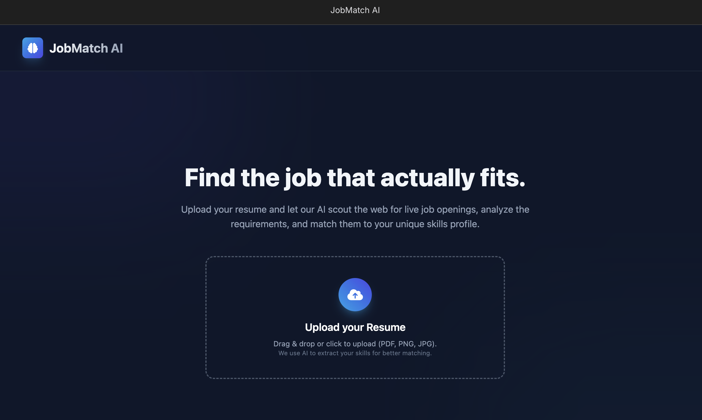
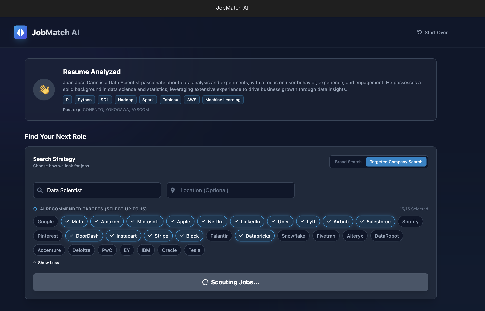
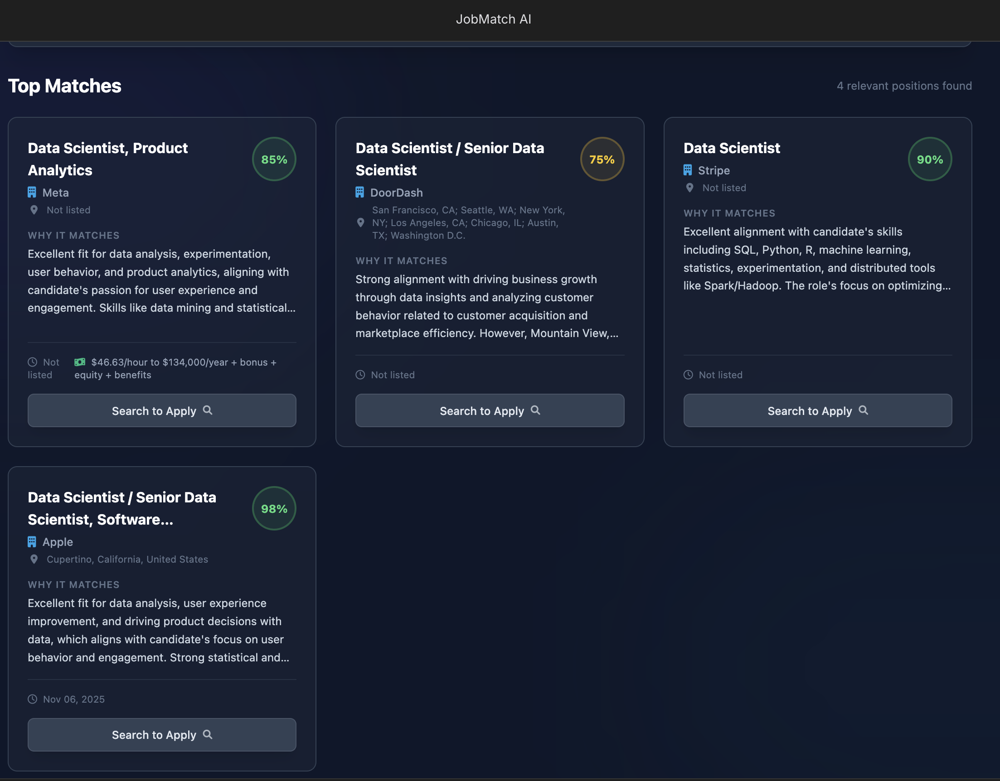

# JobMatch AI 🚀

JobMatch AI is a next-generation job search application that bridges the gap between your static resume and the live job market. 

Instead of searching for keywords manually, this app reads your resume, understands your profile using a local Large Language Model (LLM) via **Ollama**, and uses **LLocalSearch** to find live listings that actually match your skills.

## ✨ Key Features

*   **Local First**: All processing is done locally on your machine. No data is sent to the cloud.
*   **Resume Parsing**: Upload a PDF or Image of your resume. The AI extracts your summary, skills, location, and past employers.
*   **Smart Search**: Uses LLocalSearch to perform a semantic search over a local database of job listings.
*   **Match Scoring**: Every found job is compared against your resume to generate a 0-100% match score with specific reasoning.

## 🛠️ Tech Stack

*   **Frontend**: React (TypeScript)
*   **AI & Search**: LLocalSearch & Ollama
*   **Styling**: Tailwind CSS
*   **Icons**: FontAwesome

## 🚀 How to Run Locally

Follow these instructions to set up the project on your local machine.

### Prerequisites

1.  **Node.js**: Ensure you have Node installed (v16+ recommended).
2.  **Ollama**: You need to have Ollama installed and running. You can download it from [https://ollama.ai/](https://ollama.ai/).
3.  **LLocalSearch**: You need to have LLocalSearch installed and running. You can find the instructions here: [https://github.com/nilsherzig/LLocalSearch](https://github.com/nilsherzig/LLocalSearch)

### Installation Steps

1.  **Clone the repository** (or download the source code):
    ```bash
    git clone https://github.com/cfkubo/JobMatch.AI
    cd JobMatch.AI 
    ```

2.  **Install Dependencies**:
    ```bash
    npm install
    ```

3.  **Run the Application**:
    ```bash
    npm start
    ```

4.  **Open in Browser**:
    Go to `http://localhost:1234` (or whatever port your terminal says).

## 🧪 How to Test

1.  **Upload a Resume**: Drag and drop a PDF or Image of a resume.
2.  **Review Analysis**: Ensure the summary and skills look correct.
3.  **Select Strategy**:
    *   **Broad Search**: Good for seeing what's out there generally.
    *   **Targeted Search**: Click "Targeted Company Search". The AI will suggest 30 companies. Select 5-10 of them and hit "Find Matches".
4.  **Apply**: Click the links to ensure they go to the actual job postings.

## 🔒 Security Note

This is a client-side application that interacts with a local server. No data is sent to the cloud.


# Screshoots


---

---

---

##  JobMatch Song : [https://suno.com/song/4e817b6f-4e17-4f1e-88c0-9b7ccd0cd255](https://suno.com/song/4e817b6f-4e17-4f1e-88c0-9b7ccd0cd255)

## 📄 License

MIT
